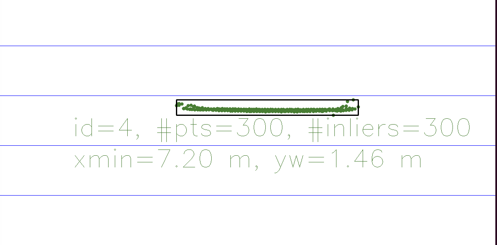
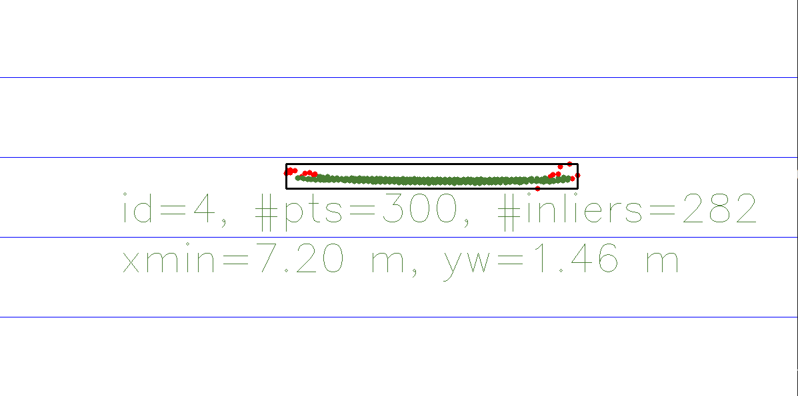

# Final Project 3D Object Tracking

## Overview

The project template that was provided was re-structured to allow ease of running
analyses from the command line in single or (compiled in batch) flows.  Example:

```
dan@ros:~/SFND_3D_Object_Tracking/build$ ./3D_object_tracking 
    incomplete arguments given.
    usage: 
    ./3D_object_tracking -d <DETECTOR_TYPE> -m <MATCHER_TYPE> -x <DESCRIPTOR_TYPE> -s <SELECTOR_TYPE> \
        [-v] [-o1] [-o2]
 
    where required argument types are:
      DETECTOR_TYPE:  SHITOMASI, HARRIS, FAST, BRISK, ORB, AKAZE, SIFT
      MATCHER_TYPE:  MAT_BF, MAT_FLANN
      DESCRIPTOR_TYPE: BRISK, BRIEF, ORB, FREAK, AKAZE, SIFT
      SELECTOR_TYPE:  SEL_NN, SEL_KNN
    optional arguments:
      -v: visualize results
      -o1: remove bounding box outliers
      -o2: remove keypoint outliers
      -b: run compiled in batch tests (output stats.csv) 
    Example:
       ./3D_object_tracking -d SHITOMASI -m MAT_BF -x BRISK -s SEL_NN
```

## Task FP.1 : Match 3D Objects

Per suggestion, a multimap was used as a pseudo sparse matrix to map the matches to one or more bounding boxes in the previous and current frames by selecting the bounding box with the maximum number of matches.

Code is found in camFusion_Student.cpp:matchBoundingBoxes

## Task FP.2 : Compute Lidar-based TTC

This task required computing the time-to-collision estimate based on successive lidar data, while accounting for outlier points in the data.  The following image, from lidar points processed from frame #11, show outliers as well as rounding in the spatial points at the edges of the ROI.



Approaches considered:

  *  Use median value of computations
  *  Use mean value of 'outlier-corrected' data.
  *  Combination of above.

A first attempt to be able to identify and remove outliers was based on pcl::StatisticalOutlierRemoval<pcl::PointXYZ>.  After some positive results, this approach was further refined to implement the algorithm directly into the function:

  camFusion_Student.cpp:findInliers()

The algorithm involves two steps:

  1.  compute the mean and standard deviation of the distances from each point in the cloud to their 'nn' nearest neighbors.

  2.  mark the points in the cloud (pt) in whch the mean distance is greater than a threshold value defined as:

```
threshold = pt.mean + std_mult*pt.sigma).   
```

In addition, the outlier detection ignores the height dimension for distance calculation (essentially squashing the points).  The following image shows the same lidar points from frame #11, but with the outliers colored in read, using nn = 10, and std_mult = 1 (show3DObjects() was modified to provide stats and annotation for assessing the algorthim).  The outliers are then ommitted from inclusion in TTC averaging.



In the subsequent analyses, values of nn=10, and std_mult=1.0 are used. This option is set by '-o1' on the command line.

## Task FP.3 : Associate Keypoint Correspondences with Bounding Boxes

For each keypoint match, we associate it to any bounding box region of interest in the current frame.  Because the following TTC estimate is based on the ratio of change between between a consensus of these matches, an approach to filtering was attempted to eliminate distance changes that were either too large or too small (both maybe more likely due to keypoint matching error).

This algorithm also involved two steps:

  1.  compute the mean and standard deviation of keypoint matches between frames

  2.  eliminate those keypoints that are less than a minimum threshold and less than a maximum threshold:
  
```  
min_threshold = max(0.0, mean - std_mult*std_dev)
max_threshold = mean + std_mult*std_dev
```

In the subsequent analyses, std_mult=1.0 is used in kpt filtering.  This option is set by '-o2' on the command line.

Note:  the author has not convinced himself that this is entirely helpful, especially considerng interaction with the TTC algorithm, and requires further analysis.

## Task FP.4 : Compute Camera-based TTC

The camera-based TTC calculation algorithm is based on the constant velocity model, using the ratio of the relative pixel-image distance changes between subsequent keypoints (which factors out intrinsic camera parameters, etc).  

```
TTC = -delta_t/(1.0 - medianDistRatio)
```

The median ratio of ratio changes was chosen to compute the TTC, as per work in previous exercises.

## Task MP.5 - Keypoint Matchers

Added FLANN and KNN alternative matcher options.   For FLANN, the matcher is parameterized by the type of the normalization parameter (either cv::flann::KDTreeIndexParams for cv::NORM_L2 descriptors or cv::flann::LshIndexParams(20, 15, 2) for cv::NORM_HAMMING descriptors)

Note:  For brute-force matchers, we use crossCheck = true to improve the quality of the matches.

## Task MP.6 - Distance Ratio Filtering

Distance ratio filtering was added to KNN selection with a min distance ratio of 0.8.

## Task MP.7 - Keypoint Detection Analysis

The following analysis of points detected within the region of the vehicle using various detectors:

| detector  | img1 | img2 | img3 | img4 | img5 | img6 | img7 | img8 | img9 | img10 | avg_pts | stddev_pts | 
|-----------|------|------|------|------|------|------|------|------|------|-------|---------|------------| 
| SHITOMASI |  125 |  118 |  123 |  120 |  120 |  113 |  114 |  123 |  111 |  112  |  117.9  |  5.1       | 
| HARRIS    |  17  |  14  |  18  |  21  |  26  |  43  |  18  |  31  |  26  |  34   |  24.8   |  9.1       | 
| FAST      |  419 |  427 |  404 |  423 |  386 |  414 |  418 |  406 |  396 |  401  |  409.4  |  13.0      | 
| BRISK     |  264 |  282 |  282 |  277 |  297 |  279 |  289 |  272 |  266 |  254  |  276.2  |  12.6      | 
| ORB       |  291 |  314 |  317 |  330 |  326 |  346 |  342 |  338 |  327 |  312  |  324.3  |  16.4      | 
| AKAZE     |  166 |  157 |  161 |  155 |  163 |  164 |  173 |  175 |  177 |  179  |  167.0  |  8.5       | 
| SIFT      |  138 |  132 |  124 |  137 |  134 |  140 |  137 |  148 |  159 |  137  |  138.6  |  9.4       | 

Of note is the HARRIS detector with a small number of detected keypoints, as well as a large variation in the detected keypoints within the vehicle region.

### Visual Assessments of Detectors

Assessment of critical keypoints, including detection of taillights, license plate, roof line, upper brake light as tracking points as well as points outside of the vehicle of interest or on ephemeral points such as shadows.

- *SHITOMASI*:  (+) points on edges, license plate, brake lights stable.  (-) many points outside of vehicle, car cast shadow.

- *HARRIS*:  (+) points on brake lights.  (-) minimal keypoints, some critical keypoints intermittent.

- *FAST*:   (+) large number of keypoints on vehicle.  (-) lots of keypoints outside region of interst, car cast shadow, some mismatches.

- *BRISK*:  (+) large number of keypoints on vehicle, esp license plate.  (-) occasional mismatch.

- *ORB*:  (+) large number of keypoints focused on upper half of vehicle (no vehicle cast shadow keypoints).  (-) minmal keypoints on license plate.

- *AKAZE*:  (+) mainly points on top of vehicle.  (-) some car cast shadow keypoints, no license plate points.

- *SIFT*:  (+) reasonable amount of keypoints, mostly on top of vehicle.  (-) some errors, keypoints shifted.

## Task MP.8 - Keypoint Matching Analysis

The following tabulates the combinations of detector and descriptor for matching using brute force (MAT_BF) and k nearest neighbor (SEL_KNN) with min descriptor distance ratio of 0.8.

| detector  | descriptor | img1-2 | img2-3 | img3-4 | img4-5 | img5-6 | img6-7 | img7-8 | img8-9 | img9-10 | 
|-----------|------------|--------|--------|--------|--------|--------|--------|--------|--------|---------| 
| SHITOMASI |  BRISK     |  752   |  731   |  708   |  697   |  703   |  685   |  715   |  753   |  715    | 
| SHITOMASI |  BRIEF     |  1003  |  981   |  992   |  987   |  931   |  947   |  973   |  1003  |  971    | 
| SHITOMASI |  ORB       |  897   |  885   |  909   |  908   |  890   |  870   |  873   |  905   |  882    | 
| SHITOMASI |  FREAK     |  730   |  723   |  751   |  717   |  712   |  713   |  700   |  726   |  686    | 
| SHITOMASI |  AKAZE     |  0     |  0     |  0     |  0     |  0     |  0     |  0     |  0     |  0      | 
| SHITOMASI |  SIFT      |  1044  |  1050  |  1068  |  1045  |  1019  |  1032  |  1033  |  1078  |  1053   | 
| HARRIS    |  BRISK     |  65    |  52    |  67    |  75    |  106   |  88    |  62    |  119   |  121    | 
| HARRIS    |  BRIEF     |  82    |  77    |  85    |  93    |  134   |  133   |  67    |  150   |  143    | 
| HARRIS    |  ORB       |  73    |  67    |  79    |  89    |  126   |  112   |  66    |  144   |  132    | 
| HARRIS    |  FREAK     |  62    |  55    |  63    |  77    |  108   |  97    |  56    |  118   |  117    | 
| HARRIS    |  AKAZE     |  93    |  80    |  91    |  98    |  142   |  140   |  74    |  163   |  161    | 
| HARRIS    |  SIFT      |  90    |  77    |  90    |  95    |  141   |  120   |  72    |  154   |  160    | 
| FAST      |  BRISK     |  2241  |  2231  |  2194  |  2167  |  2218  |  2156  |  2066  |  2199  |  2182   | 
| FAST      |  BRIEF     |  3041  |  2994  |  3037  |  3014  |  2941  |  2930  |  2899  |  2992  |  2980   | 
| FAST      |  ORB       |  2723  |  2741  |  2777  |  2742  |  2758  |  2688  |  2690  |  2761  |  2744   | 
| FAST      |  FREAK     |  2160  |  2170  |  2140  |  2163  |  2205  |  2141  |  2071  |  2199  |  2153   | 
| FAST      |  AKAZE     |  0     |  0     |  0     |  0     |  0     |  0     |  0     |  0     |  0      | 
| FAST      |  SIFT      |  3354  |  3256  |  3260  |  3229  |  3208  |  3281  |  3256  |  3281  |  3337   | 
| BRISK     |  BRISK     |  1494  |  1486  |  1477  |  1400  |  1451  |  1368  |  1400  |  1373  |  1385   | 
| BRISK     |  BRIEF     |  1689  |  1739  |  1746  |  1674  |  1666  |  1622  |  1660  |  1646  |  1601   | 
| BRISK     |  ORB       |  1435  |  1440  |  1417  |  1392  |  1417  |  1371  |  1357  |  1364  |  1346   | 
| BRISK     |  FREAK     |  1333  |  1343  |  1358  |  1297  |  1369  |  1322  |  1296  |  1308  |  1285   | 
| BRISK     |  AKAZE     |  0     |  0     |  0     |  0     |  0     |  0     |  0     |  0     |  0      | 
| BRISK     |  SIFT      |  1677  |  1699  |  1648  |  1625  |  1688  |  1607  |  1645  |  1572  |  1580   | 
| ORB       |  BRISK     |  1209  |  1243  |  1265  |  1222  |  1251  |  1253  |  1239  |  1200  |  1176   | 
| ORB       |  BRIEF     |  967   |  923   |  872   |  907   |  903   |  907   |  935   |  880   |  919    | 
| ORB       |  ORB       |  1273  |  1301  |  1321  |  1298  |  1301  |  1308  |  1280  |  1265  |  1262   | 
| ORB       |  FREAK     |  429   |  460   |  476   |  489   |  488   |  490   |  470   |  468   |  529    | 
| ORB       |  AKAZE     |  0     |  0     |  0     |  0     |  0     |  0     |  0     |  0     |  0      | 
| ORB       |  SIFT      |  1375  |  1357  |  1404  |  1412  |  1392  |  1365  |  1387  |  1355  |  1392   | 
| AKAZE     |  BRISK     |  894   |  881   |  898   |  908   |  906   |  943   |  933   |  945   |  931    | 
| AKAZE     |  BRIEF     |  949   |  968   |  985   |  988   |  979   |  1005  |  1011  |  1003  |  983    | 
| AKAZE     |  ORB       |  868   |  899   |  872   |  862   |  878   |  913   |  905   |  902   |  875    | 
| AKAZE     |  FREAK     |  832   |  855   |  848   |  847   |  872   |  873   |  873   |  934   |  902    | 
| AKAZE     |  AKAZE     |  1011  |  1025  |  1021  |  1027  |  1022  |  1039  |  1026  |  1043  |  999    | 
| AKAZE     |  SIFT      |  1033  |  1051  |  1025  |  1057  |  1055  |  1067  |  1057  |  1058  |  1046   | 
| SIFT      |  BRISK     |  567   |  561   |  564   |  539   |  542   |  544   |  551   |  531   |  561    | 
| SIFT      |  BRIEF     |  702   |  653   |  666   |  639   |  648   |  652   |  671   |  619   |  673    | 
| SIFT      |  FREAK     |  539   |  522   |  537   |  510   |  518   |  510   |  545   |  518   |  537    | 
| SIFT      |  AKAZE     |  0     |  0     |  0     |  0     |  0     |  0     |  0     |  0     |  0      | 
| SIFT      |  SIFT      |  803   |  781   |  759   |  754   |  755   |  738   |  743   |  814   |  815    | 

Note:  Akaze descriptors with non-Akaze detection resulted in exceptions.


## Task MP.9 - Feature Detecting Analysis

Below are the top three recommendations for keypoint detection for vehicle tracking (full table follows).  

|rank | detect    |  descript |  matcher   |  select  |  det[ms] |  #kpts |  desc[ms] |  match[ms] |  #mat_kpts | avg_total_time[ms] | #mat_vehkpts | 
|-----|-----------|-----------|------------|----------|----------|--------|-----------|------------|------------|--------------------|--------------|
| 1   | ORB       |  BRISK    |  MAT_BF    |  SEL_KNN | 128.626  | 2000   | 52.2      | 20.8       | 1228       | 201.7              | 226          | 
| 2   | FAST      |  ORB      |  MAT_BF    |  SEL_KNN | 40.7212  | 4904   | 65.4      | 145.4      | 2736       | 251.4              | 306          | 
| 3   | SHITOMASI |  ORB      |  MAT_BF    |  SEL_KNN | 77.7339  | 1339   | 32.1      | 14.9       | 891        | 124.8              | 100          | 


### Selection Rationale

The criteria for selection included:

1. Accuracy and repeatability (generally excluded HARRIS detectors) - verified visually match quality
2. Number of features detected within region of interested (negatively affected SHITOMASI detector flows)
3. Performance - minimal average total processing time and maximal features per second.

All selected detectors used brute-force matching with K-nearest neighbor selection.   The ORB/2000 - BRISK flow was top choice due to a combination of being reasonably performant, with a larger number of keypoints detected within the region of interest.   The FAST - ORB combination came in second, primarily due to the slower processing time.   The third option was chosen because produced what was considered a sufficient number of tracking points on the region of interest, and did so in a performant manner - approximately twice the speed of first two choices.

Additional Notes:  The ORB and FAST detectors allow selection of the number of detected keypoints.  Both could potentially be optimized to better suit throughput targets.    ORB descriptors seemed to perform well overall (based on number of keypoints processed and with brute-force/knn matching) for any keypoint method employed.

### Full Table of Detector/Descriptor Results:

| detect    |  descript |  matcher   |  select  |  det[ms] |  #kpts |  desc[ms] |  match[ms] |  #mat_kpts | avg_total_time[ms] | pts_sec | 
|-----------|-----------|------------|----------|----------|----------------|-----------|------------|---------------|----------------|---------| 
| HARRIS    |  BRISK    |  MAT_BF    |  SEL_KNN | 76.8733  | 180            | 5.93221   | 0.704258   | 83            | 83.51          | 994     | 
| HARRIS    |  BRISK    |  MAT_BF    |  SEL_NN  | 77.6858  | 180            | 5.83177   | 0.968041   | 90            | 84.49          | 1065    | 
| HARRIS    |  BRIEF    |  MAT_BF    |  SEL_KNN | 78.4427  | 180            | 7.18155   | 0.809005   | 107           | 86.43          | 1238    | 
| HARRIS    |  BRIEF    |  MAT_BF    |  SEL_NN  | 78.7623  | 180            | 7.0369    | 1.05365    | 101           | 86.85          | 1163    | 
| HARRIS    |  ORB      |  MAT_BF    |  SEL_NN  | 79.6146  | 180            | 21.1884   | 1.27585    | 94            | 102.08         | 921     | 
| HARRIS    |  BRIEF    |  MAT_FLANN |  SEL_NN  | 78.0075  | 180            | 6.71901   | 19.9148    | 154           | 104.64         | 1472    | 
| HARRIS    |  ORB      |  MAT_BF    |  SEL_KNN | 82.4238  | 180            | 22.6496   | 0.795571   | 98            | 105.87         | 926     | 
| HARRIS    |  BRISK    |  MAT_FLANN |  SEL_NN  | 77.496   | 180            | 5.7936    | 25.0564    | 157           | 108.35         | 1449    | 
| HARRIS    |  BRIEF    |  MAT_FLANN |  SEL_KNN | 80.1704  | 180            | 7.01908   | 21.3348    | 107           | 108.52         | 986     | 
| HARRIS    |  BRISK    |  MAT_FLANN |  SEL_KNN | 77.8165  | 180            | 5.90232   | 25.8408    | 84            | 109.56         | 767     | 
| SHITOMASI |  ORB      |  MAT_BF    |  SEL_KNN | 77.7339  | 1339           | 32.1486   | 14.9347    | 891           | 124.82         | 7138    | 
| HARRIS    |  ORB      |  MAT_FLANN |  SEL_KNN | 80.3332  | 180            | 22.414    | 22.527     | 98            | 125.27         | 782     | 
| SHITOMASI |  BRISK    |  MAT_BF    |  SEL_KNN | 75.962   | 1339           | 36.263    | 15.2748    | 717           | 127.50         | 5624    | 
| HARRIS    |  ORB      |  MAT_FLANN |  SEL_NN  | 86.2295  | 180            | 22.4899   | 24.1831    | 152           | 132.90         | 1144    | 
| SHITOMASI |  BRIEF    |  MAT_BF    |  SEL_KNN | 77.1979  | 1339           | 44.3382   | 14.2477    | 976           | 135.78         | 7188    | 
| SHITOMASI |  ORB      |  MAT_BF    |  SEL_NN  | 78.7122  | 1339           | 32.828    | 27.1805    | 913           | 138.72         | 6582    | 
| SHITOMASI |  BRISK    |  MAT_BF    |  SEL_NN  | 76.0711  | 1339           | 36.4203   | 30.1073    | 826           | 142.60         | 5792    | 
| SHITOMASI |  BRIEF    |  MAT_BF    |  SEL_NN  | 77.0629  | 1339           | 44.9044   | 29.0785    | 977           | 151.05         | 6468    | 
| HARRIS    |  FREAK    |  MAT_BF    |  SEL_KNN | 74.5762  | 180            | 76.174    | 0.657558   | 83            | 151.41         | 548     | 
| HARRIS    |  FREAK    |  MAT_BF    |  SEL_NN  | 75.7374  | 180            | 76.2663   | 1.51271    | 86            | 153.52         | 560     | 
| HARRIS    |  FREAK    |  MAT_FLANN |  SEL_NN  | 74.6096  | 180            | 75.3391   | 27.696     | 155           | 177.64         | 873     | 
| HARRIS    |  FREAK    |  MAT_FLANN |  SEL_KNN | 74.7266  | 180            | 76.4241   | 27.9743    | 83            | 179.13         | 463     | 
| SHITOMASI |  FREAK    |  MAT_BF    |  SEL_KNN | 73.6171  | 1339           | 100.939   | 20.3776    | 717           | 194.93         | 3678    | 
| ORB       |  BRISK    |  MAT_BF    |  SEL_KNN | 128.626  | 2000           | 52.2385   | 20.7843    | 1228          | 201.65         | 6090    | 
| SHITOMASI |  FREAK    |  MAT_BF    |  SEL_NN  | 75.8697  | 1339           | 102.219   | 39.0772    | 810           | 217.17         | 3730    | 
| ORB       |  FREAK    |  MAT_BF    |  SEL_KNN | 130.073  | 2000           | 90.1174   | 6.39304    | 477           | 226.58         | 2105    | 
| ORB       |  FREAK    |  MAT_BF    |  SEL_NN  | 130.033  | 2000           | 89.6327   | 10.7991    | 448           | 230.46         | 1944    | 
| ORB       |  BRIEF    |  MAT_BF    |  SEL_KNN | 131.413  | 2000           | 68.656    | 33.7623    | 912           | 233.83         | 3900    | 
| ORB       |  BRISK    |  MAT_BF    |  SEL_NN  | 141.363  | 2000           | 52.7468   | 45.2776    | 1171          | 239.39         | 4892    | 
| BRISK     |  BRIEF    |  MAT_BF    |  SEL_KNN | 116.084  | 2706           | 88.7405   | 46.0053    | 1671          | 250.83         | 6662    | 
| FAST      |  ORB      |  MAT_BF    |  SEL_KNN | 40.7212  | 4904           | 65.3633   | 145.352    | 2736          | 251.44         | 10881   | 
| BRISK     |  ORB      |  MAT_BF    |  SEL_KNN | 114.809  | 2706           | 99.7926   | 41.7155    | 1393          | 256.32         | 5435    | 
| BRISK     |  BRISK    |  MAT_BF    |  SEL_KNN | 115.852  | 2706           | 78.7087   | 69.7997    | 1426          | 264.36         | 5394    | 
| ORB       |  BRIEF    |  MAT_BF    |  SEL_NN  | 134.099  | 2000           | 68.9626   | 70.9353    | 956           | 274.00         | 3489    | 
| ORB       |  ORB      |  MAT_BF    |  SEL_KNN | 128.387  | 2000           | 103.876   | 44.9519    | 1289          | 277.21         | 4650    | 
| BRISK     |  FREAK    |  MAT_BF    |  SEL_KNN | 119.368  | 2706           | 131.057   | 44.5711    | 1323          | 295.00         | 4485    | 
| BRISK     |  BRIEF    |  MAT_BF    |  SEL_NN  | 120.505  | 2706           | 88.0788   | 88.871     | 1590          | 297.45         | 5345    | 
| BRISK     |  ORB      |  MAT_BF    |  SEL_NN  | 115.624  | 2706           | 99.0743   | 89.5611    | 1539          | 304.26         | 5058    | 
| ORB       |  ORB      |  MAT_BF    |  SEL_NN  | 129.075  | 2000           | 104.469   | 71.9234    | 1369          | 305.47         | 4482    | 
| FAST      |  BRIEF    |  MAT_BF    |  SEL_KNN | 40.3575  | 4904           | 139.543   | 138.62     | 2980          | 318.52         | 9356    | 
| BRISK     |  BRISK    |  MAT_BF    |  SEL_NN  | 115.339  | 2706           | 78.0211   | 146.148    | 1558          | 339.51         | 4589    | 
| BRISK     |  FREAK    |  MAT_BF    |  SEL_NN  | 116.063  | 2706           | 130.225   | 96.0375    | 1391          | 342.33         | 4063    | 
| FAST      |  BRISK    |  MAT_BF    |  SEL_KNN | 39.7102  | 4904           | 136.317   | 192.891    | 2183          | 368.92         | 5917    | 
| ORB       |  FREAK    |  MAT_FLANN |  SEL_NN  | 128.912  | 2000           | 90.2631   | 160.122    | 628           | 379.30         | 1656    | 
| ORB       |  FREAK    |  MAT_FLANN |  SEL_KNN | 130.017  | 2000           | 89.1457   | 161.753    | 477           | 380.92         | 1252    | 
| FAST      |  ORB      |  MAT_BF    |  SEL_NN  | 39.7561  | 4904           | 65.1978   | 296.687    | 2754          | 401.64         | 6857    | 
| FAST      |  FREAK    |  MAT_BF    |  SEL_KNN | 39.7234  | 4904           | 190.098   | 191.366    | 2155          | 421.19         | 5116    | 
| FAST      |  BRIEF    |  MAT_BF    |  SEL_NN  | 39.6728  | 4904           | 140.143   | 267.634    | 2910          | 447.45         | 6504    | 
| HARRIS    |  SIFT     |  MAT_BF    |  SEL_KNN | 73.851   | 180            | 419.073   | 3.89345    | 111           | 496.82         | 223     | 
| HARRIS    |  SIFT     |  MAT_BF    |  SEL_NN  | 76.0981  | 180            | 417.222   | 8.0705     | 108           | 501.39         | 215     | 
| HARRIS    |  SIFT     |  MAT_FLANN |  SEL_NN  | 74.5758  | 180            | 418.426   | 17.3812    | 161           | 510.38         | 315     | 
| HARRIS    |  SIFT     |  MAT_FLANN |  SEL_KNN | 74.3209  | 180            | 419.711   | 18.0985    | 111           | 512.13         | 217     | 
| SHITOMASI |  BRIEF    |  MAT_FLANN |  SEL_NN  | 75.6779  | 1339           | 43.7592   | 413.9      | 1231          | 533.34         | 2308    | 
| SHITOMASI |  BRIEF    |  MAT_FLANN |  SEL_KNN | 75.6099  | 1339           | 43.9996   | 418.437    | 976           | 538.05         | 1814    | 
| FAST      |  BRISK    |  MAT_BF    |  SEL_NN  | 39.8745  | 4904           | 132.943   | 371.72     | 2602          | 544.54         | 4778    | 
| AKAZE     |  BRISK    |  MAT_BF    |  SEL_KNN | 522.84   | 1342           | 37.6834   | 15.8988    | 915           | 576.42         | 1587    | 
| FAST      |  FREAK    |  MAT_BF    |  SEL_NN  | 40.3176  | 4904           | 188.69    | 351.467    | 2517          | 580.47         | 4336    | 
| HARRIS    |  AKAZE    |  MAT_BF    |  SEL_KNN | 75.4243  | 180            | 505.428   | 0.5748     | 115           | 581.43         | 198     | 
| HARRIS    |  AKAZE    |  MAT_BF    |  SEL_NN  | 77.4923  | 180            | 508.893   | 0.940852   | 109           | 587.33         | 186     | 
| SHITOMASI |  ORB      |  MAT_FLANN |  SEL_KNN | 75.7156  | 1339           | 31.8506   | 494.214    | 891           | 601.78         | 1481    | 
| SHITOMASI |  ORB      |  MAT_FLANN |  SEL_NN  | 75.7295  | 1339           | 32.3055   | 494.924    | 1219          | 602.96         | 2022    | 
| AKAZE     |  BRISK    |  MAT_BF    |  SEL_NN  | 533.915  | 1342           | 38.2981   | 33.0823    | 985           | 605.30         | 1627    | 
| AKAZE     |  BRIEF    |  MAT_BF    |  SEL_KNN | 543.156  | 1342           | 45.4834   | 20.7666    | 985           | 609.41         | 1616    | 
| HARRIS    |  AKAZE    |  MAT_FLANN |  SEL_NN  | 77.0869  | 180            | 519.932   | 19.9439    | 161           | 616.96         | 261     | 
| HARRIS    |  AKAZE    |  MAT_FLANN |  SEL_KNN | 79.524   | 180            | 517.872   | 20.5523    | 116           | 617.95         | 188     | 
| AKAZE     |  ORB      |  MAT_BF    |  SEL_KNN | 542.971  | 1342           | 63.2824   | 23.7657    | 886           | 630.02         | 1406    | 
| AKAZE     |  ORB      |  MAT_BF    |  SEL_NN  | 532.612  | 1342           | 61.9908   | 44.0962    | 944           | 638.70         | 1478    | 
| AKAZE     |  BRIEF    |  MAT_BF    |  SEL_NN  | 544.234  | 1342           | 45.9169   | 55.1235    | 1002          | 645.27         | 1553    | 
| AKAZE     |  FREAK    |  MAT_BF    |  SEL_KNN | 530.491  | 1342           | 102.043   | 14.5601    | 870           | 647.09         | 1344    | 
| SHITOMASI |  SIFT     |  MAT_FLANN |  SEL_NN  | 72.0445  | 1339           | 433.803   | 142.569    | 1342          | 648.42         | 2070    | 
| SHITOMASI |  SIFT     |  MAT_FLANN |  SEL_KNN | 72.5531  | 1339           | 433.798   | 153.077    | 1049          | 659.43         | 1591    | 
| AKAZE     |  FREAK    |  MAT_BF    |  SEL_NN  | 536.991  | 1342           | 102.653   | 28.9299    | 946           | 668.57         | 1415    | 
| SHITOMASI |  SIFT     |  MAT_BF    |  SEL_KNN | 71.7202  | 1339           | 434.113   | 258.183    | 1046          | 764.02         | 1369    | 
| SHITOMASI |  BRISK    |  MAT_FLANN |  SEL_KNN | 75.8815  | 1339           | 36.481    | 682.363    | 718           | 794.73         | 903     | 
| SHITOMASI |  BRISK    |  MAT_FLANN |  SEL_NN  | 77.1337  | 1339           | 36.4849   | 693.459    | 1290          | 807.08         | 1598    | 
| ORB       |  BRISK    |  MAT_FLANN |  SEL_KNN | 126.959  | 2000           | 53.0792   | 666.55     | 1228          | 846.59         | 1451    | 
| ORB       |  ORB      |  MAT_FLANN |  SEL_NN  | 127.427  | 2000           | 102.068   | 619.415    | 2000          | 848.91         | 2356    | 
| ORB       |  ORB      |  MAT_FLANN |  SEL_KNN | 126.539  | 2000           | 102.571   | 624.056    | 1290          | 853.17         | 1512    | 
| ORB       |  BRISK    |  MAT_FLANN |  SEL_NN  | 128.987  | 2000           | 53.0369   | 690.701    | 1581          | 872.72         | 1812    | 
| AKAZE     |  ORB      |  MAT_FLANN |  SEL_KNN | 529.496  | 1342           | 62.0855   | 341.504    | 886           | 933.09         | 950     | 
| AKAZE     |  ORB      |  MAT_FLANN |  SEL_NN  | 532.492  | 1342           | 63.5804   | 347.694    | 1341          | 943.77         | 1421    | 
| SHITOMASI |  FREAK    |  MAT_FLANN |  SEL_KNN | 71.1551  | 1339           | 100.712   | 772.042    | 717           | 943.91         | 760     | 
| SHITOMASI |  FREAK    |  MAT_FLANN |  SEL_NN  | 71.1222  | 1339           | 99.5704   | 806.537    | 1247          | 977.23         | 1276    | 
| SHITOMASI |  SIFT     |  MAT_BF    |  SEL_NN  | 73.1721  | 1339           | 433.121   | 484.841    | 1079          | 991.13         | 1089    | 
| AKAZE     |  AKAZE    |  MAT_BF    |  SEL_KNN | 529.105  | 1342           | 522.471   | 17.1824    | 1023          | 1068.76        | 957     | 
| AKAZE     |  AKAZE    |  MAT_BF    |  SEL_NN  | 527.694  | 1342           | 520.532   | 34.0865    | 1047          | 1082.31        | 967     | 
| AKAZE     |  BRIEF    |  MAT_FLANN |  SEL_NN  | 528.989  | 1342           | 44.4986   | 510.564    | 1344          | 1084.05        | 1240    | 
| AKAZE     |  BRIEF    |  MAT_FLANN |  SEL_KNN | 534.996  | 1342           | 45.3245   | 506.014    | 985           | 1086.33        | 907     | 
| ORB       |  BRIEF    |  MAT_FLANN |  SEL_NN  | 126.267  | 2000           | 65.523    | 1004.1     | 2000          | 1195.89        | 1672    | 
| ORB       |  BRIEF    |  MAT_FLANN |  SEL_KNN | 125.74   | 2000           | 67.1069   | 1005.37    | 912           | 1198.22        | 761     | 
| AKAZE     |  SIFT     |  MAT_FLANN |  SEL_NN  | 533.277  | 1342           | 591.994   | 145.41     | 1344          | 1270.68        | 1058    | 
| AKAZE     |  SIFT     |  MAT_FLANN |  SEL_KNN | 534.927  | 1342           | 596.27    | 155.934    | 1055          | 1287.13        | 820     | 
| BRISK     |  ORB      |  MAT_FLANN |  SEL_NN  | 115.54   | 2706           | 99.4362   | 1081.77    | 2674          | 1296.75        | 2062    | 
| BRISK     |  ORB      |  MAT_FLANN |  SEL_KNN | 117.15   | 2706           | 99.097    | 1110.77    | 1393          | 1327.02        | 1050    | 
| FAST      |  SIFT     |  MAT_FLANN |  SEL_NN  | 39.3191  | 4904           | 738.249   | 563.167    | 4911          | 1340.74        | 3663    | 
| BRISK     |  SIFT     |  MAT_FLANN |  SEL_NN  | 114.952  | 2706           | 909.937   | 316.705    | 2716          | 1341.59        | 2024    | 
| BRISK     |  SIFT     |  MAT_FLANN |  SEL_KNN | 114.576  | 2706           | 912.139   | 329.189    | 1693          | 1355.90        | 1249    | 
| AKAZE     |  BRISK    |  MAT_FLANN |  SEL_NN  | 525.648  | 1342           | 37.3679   | 802.075    | 1344          | 1365.09        | 985     | 
| AKAZE     |  BRISK    |  MAT_FLANN |  SEL_KNN | 528.714  | 1342           | 38.0884   | 808.693    | 915           | 1375.50        | 665     | 
| FAST      |  SIFT     |  MAT_FLANN |  SEL_KNN | 39.3442  | 4904           | 739.993   | 598.397    | 3345          | 1377.73        | 2428    | 
| AKAZE     |  SIFT     |  MAT_BF    |  SEL_KNN | 531.536  | 1342           | 592.745   | 263.378    | 1049          | 1387.66        | 756     | 
| AKAZE     |  AKAZE    |  MAT_FLANN |  SEL_NN  | 524.723  | 1342           | 523.755   | 554.567    | 1344          | 1603.05        | 838     | 
| AKAZE     |  AKAZE    |  MAT_FLANN |  SEL_KNN | 525.544  | 1342           | 520.405   | 558.736    | 1023          | 1604.69        | 638     | 
| AKAZE     |  SIFT     |  MAT_BF    |  SEL_NN  | 528.796  | 1342           | 597.904   | 492.797    | 1076          | 1619.50        | 664     | 
| ORB       |  SIFT     |  MAT_FLANN |  SEL_KNN | 127.677  | 2000           | 1307.5    | 232.566    | 1394          | 1667.74        | 836     | 
| ORB       |  SIFT     |  MAT_FLANN |  SEL_NN  | 129.276  | 2000           | 1330.84   | 222.498    | 2000          | 1682.61        | 1189    | 
| BRISK     |  BRIEF    |  MAT_FLANN |  SEL_NN  | 116.854  | 2706           | 89.0781   | 1625.51    | 2687          | 1831.44        | 1467    | 
| BRISK     |  BRIEF    |  MAT_FLANN |  SEL_KNN | 114.659  | 2706           | 89.7281   | 1630.66    | 1671          | 1835.05        | 911     | 
| BRISK     |  SIFT     |  MAT_BF    |  SEL_KNN | 115.856  | 2706           | 910.079   | 946.34     | 1637          | 1972.28        | 830     | 
| ORB       |  SIFT     |  MAT_BF    |  SEL_KNN | 126.403  | 2000           | 1318.2    | 544.871    | 1382          | 1989.47        | 695     | 
| AKAZE     |  FREAK    |  MAT_FLANN |  SEL_KNN | 528.741  | 1342           | 101.841   | 1362.03    | 870           | 1992.61        | 437     | 
| AKAZE     |  FREAK    |  MAT_FLANN |  SEL_NN  | 529.353  | 1342           | 103.225   | 1360.86    | 1344          | 1993.44        | 674     | 
| SIFT      |  BRISK    |  MAT_BF    |  SEL_KNN | 2050.96  | 1380           | 36.7253   | 16.4052    | 551           | 2104.09        | 262     | 
| SIFT      |  BRIEF    |  MAT_BF    |  SEL_KNN | 2081.95  | 1380           | 39.2859   | 13.4605    | 658           | 2134.70        | 308     | 
| SIFT      |  BRIEF    |  MAT_BF    |  SEL_NN  | 2058.73  | 1380           | 40.2136   | 43.9449    | 714           | 2142.89        | 333     | 
| SIFT      |  BRISK    |  MAT_BF    |  SEL_NN  | 2091.58  | 1380           | 37.2984   | 33.1752    | 671           | 2162.05        | 310     | 
| SIFT      |  FREAK    |  MAT_BF    |  SEL_KNN | 2091.75  | 1380           | 102.486   | 13.4367    | 526           | 2207.67        | 238     | 
| SIFT      |  FREAK    |  MAT_BF    |  SEL_NN  | 2089.89  | 1380           | 101.826   | 25.276     | 639           | 2216.99        | 288     | 
| BRISK     |  FREAK    |  MAT_FLANN |  SEL_KNN | 119.036  | 2706           | 131.991   | 1976.95    | 1323          | 2227.98        | 594     | 
| BRISK     |  FREAK    |  MAT_FLANN |  SEL_NN  | 119.392  | 2706           | 132.477   | 2047.06    | 2302          | 2298.93        | 1001    | 
| ORB       |  SIFT     |  MAT_BF    |  SEL_NN  | 125.942  | 2000           | 1306.31   | 1033.69    | 1268          | 2465.94        | 514     | 
| BRISK     |  BRISK    |  MAT_FLANN |  SEL_NN  | 114.896  | 2706           | 78.6215   | 2308.99    | 2716          | 2502.51        | 1085    | 
| SIFT      |  BRIEF    |  MAT_FLANN |  SEL_NN  | 2076.63  | 1380           | 39.8708   | 394.44     | 1260          | 2510.94        | 502     | 
| BRISK     |  BRISK    |  MAT_FLANN |  SEL_KNN | 116.483  | 2706           | 79.4687   | 2321.55    | 1426          | 2517.50        | 566     | 
| SIFT      |  BRIEF    |  MAT_FLANN |  SEL_KNN | 2085.28  | 1380           | 40.1983   | 404.6      | 658           | 2530.08        | 260     | 
| SIFT      |  BRISK    |  MAT_FLANN |  SEL_NN  | 2045.14  | 1380           | 36.8024   | 644.996    | 1320          | 2726.94        | 484     | 
| SIFT      |  BRISK    |  MAT_FLANN |  SEL_KNN | 2052.07  | 1380           | 36.7373   | 653.538    | 551           | 2742.35        | 201     | 
| BRISK     |  SIFT     |  MAT_BF    |  SEL_NN  | 115.826  | 2706           | 913.298   | 1858.03    | 1581          | 2887.15        | 548     | 
| SIFT      |  FREAK    |  MAT_FLANN |  SEL_NN  | 2093.36  | 1380           | 103.193   | 852.499    | 1256          | 3049.05        | 412     | 
| SIFT      |  FREAK    |  MAT_FLANN |  SEL_KNN | 2090.63  | 1380           | 102.574   | 874.673    | 526           | 3067.88        | 171     | 
| FAST      |  SIFT     |  MAT_BF    |  SEL_KNN | 39.558   | 4904           | 740.879   | 2987.78    | 3273          | 3768.22        | 869     | 
| FAST      |  BRIEF    |  MAT_FLANN |  SEL_KNN | 39.3724  | 4904           | 140.617   | 3738.09    | 2980          | 3918.08        | 761     | 
| FAST      |  BRIEF    |  MAT_FLANN |  SEL_NN  | 39.4713  | 4904           | 144.233   | 3752.26    | 4378          | 3935.96        | 1112    | 
| SIFT      |  SIFT     |  MAT_FLANN |  SEL_NN  | 2046.61  | 1380           | 2065.3    | 152.507    | 1381          | 4264.42        | 324     | 
| SIFT      |  SIFT     |  MAT_FLANN |  SEL_KNN | 2046.88  | 1380           | 2065.34   | 159.268    | 782           | 4271.49        | 183     | 
| SIFT      |  SIFT     |  MAT_BF    |  SEL_KNN | 2057.86  | 1380           | 2065.49   | 271.451    | 773           | 4394.80        | 176     | 
| SIFT      |  SIFT     |  MAT_BF    |  SEL_NN  | 2051.54  | 1380           | 2086.49   | 515.555    | 834           | 4653.59        | 179     | 
| FAST      |  ORB      |  MAT_FLANN |  SEL_KNN | 39.2628  | 4904           | 65.4424   | 4574.86    | 2736          | 4679.57        | 585     | 
| FAST      |  ORB      |  MAT_FLANN |  SEL_NN  | 39.5808  | 4904           | 66.1047   | 4585.49    | 4320          | 4691.18        | 921     | 
| FAST      |  SIFT     |  MAT_BF    |  SEL_NN  | 40.0014  | 4904           | 754.366   | 5987.4     | 3357          | 6781.77        | 495     | 
| FAST      |  BRISK    |  MAT_FLANN |  SEL_KNN | 39.3163  | 4904           | 134.962   | 6987.82    | 2184          | 7162.10        | 305     | 
| FAST      |  BRISK    |  MAT_FLANN |  SEL_NN  | 39.6312  | 4904           | 136.366   | 7080.64    | 4672          | 7256.64        | 644     | 
| FAST      |  FREAK    |  MAT_FLANN |  SEL_KNN | 39.1044  | 4904           | 188.219   | 8216.46    | 2156          | 8443.78        | 255     | 
| FAST      |  FREAK    |  MAT_FLANN |  SEL_NN  | 39.9213  | 4904           | 191.7     | 8670.51    | 4464          | 8902.13        | 501     | 



